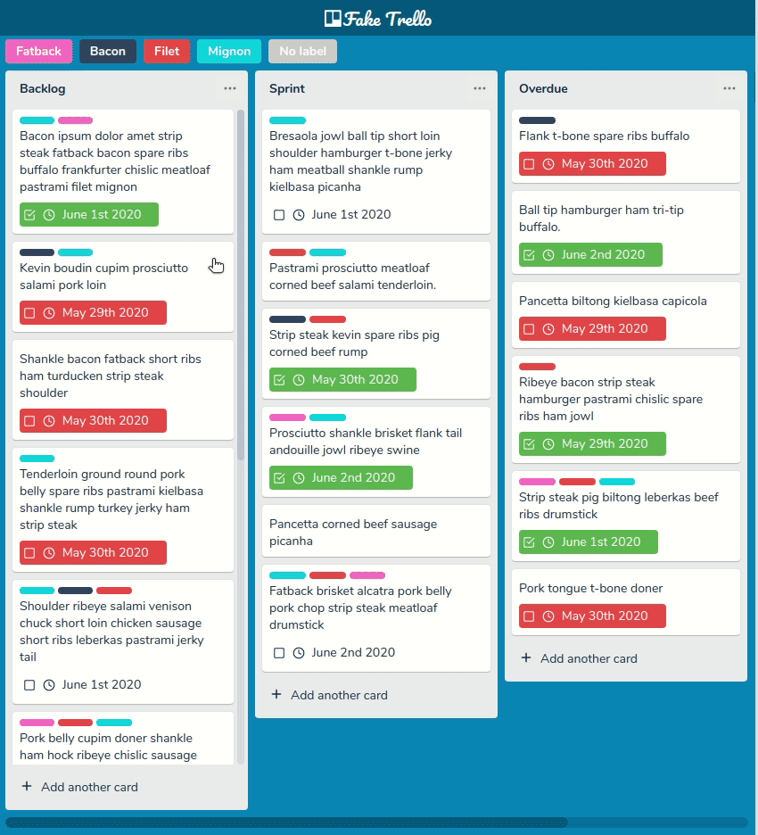
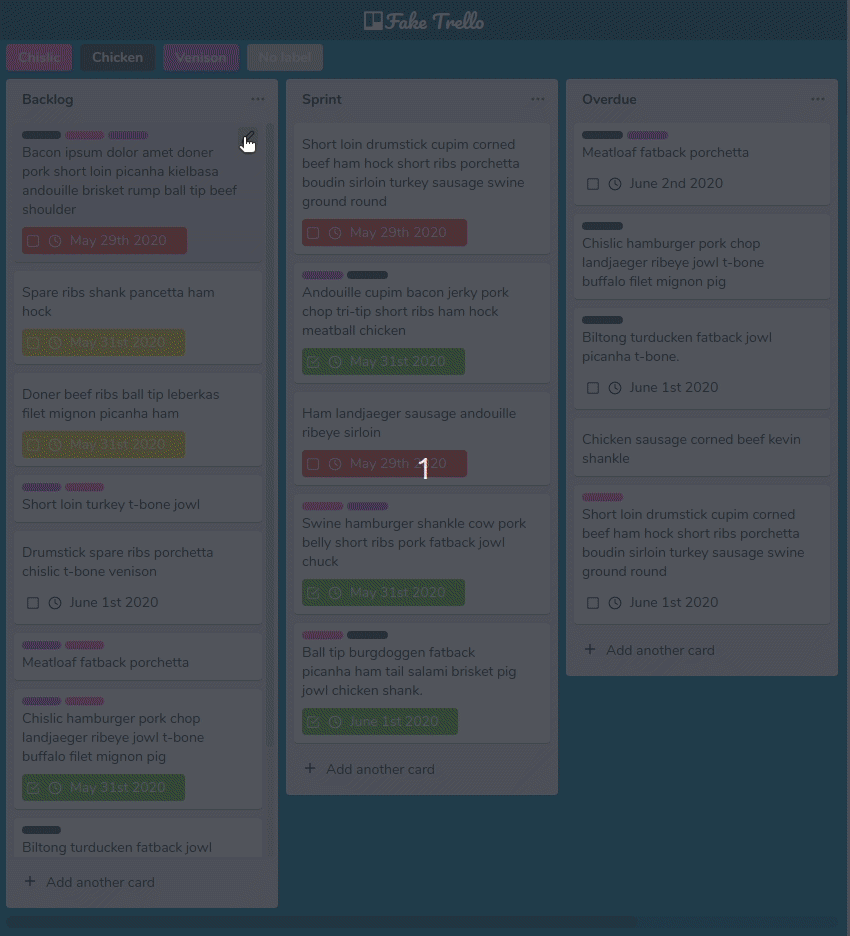
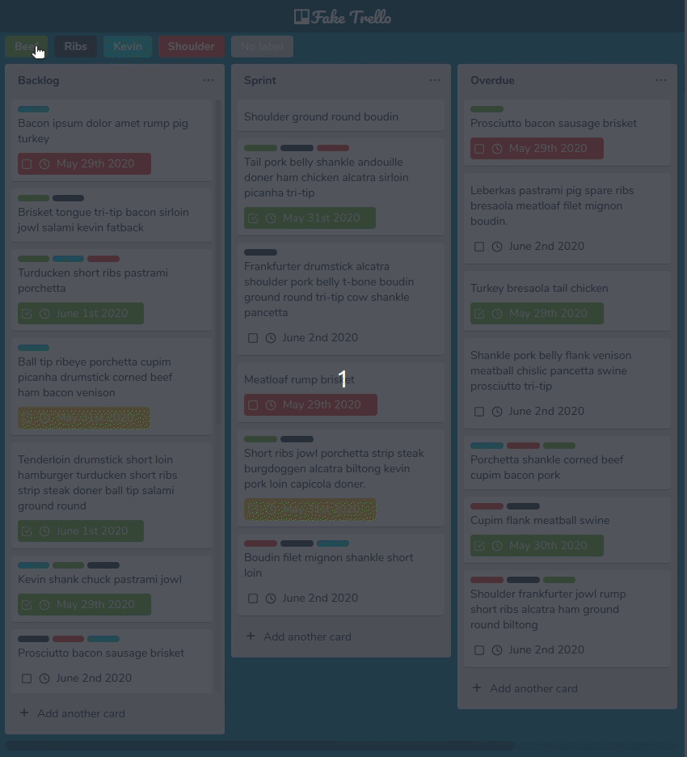

  

<h1 align="center" >Fake Trello</h1>

<blockquote align="center">
  A simple task manager for pesonal use inspired by trello interface.
</blockquote>

  

  

  

|&nbsp;&nbsp;&nbsp;
  <a href="https://cazuzabarberino.github.io/fake-trello/" target="_blank">
    Live Demo
  </a>
  &nbsp;&nbsp;&nbsp;|

  

## Contents

- [Motivation](#Motivation)
- [Features](#Features)
- [Libraries & Technologies](#Libraries-Technologies)
- [Instalation](#Instalation)
- [Media](#Media)

## Motivation

I wanted to challenge myself by creating a "drag and drop" system from scratch. During development, I learned a lot about React and would do a few different things if I remade the project, but I am quite happy with the end result.

## Features

  - Create and delete task lists.
  - Create and delete tasks.
  - Organize tasks and lists through drag and drop.
  - Set due date for tasks.
  - Create labels to better organize tasks.
  - Filter tasks by label.

## Libraries & Technologies

#### :wrench: Main Technologies:

- React JS
  - Hooks
- TypeScript

#### :file_folder: Libraries:

- Moment JS
- Axios
- Styled Components
- Polished
- Shortid
- React Icons

#### :earth_americas: Placeholder Text Api:

- [Bacon Ipsum](https://baconipsum.com/json-api/)

## Instalation

1. Have [Node.js](https://nodejs.org/en/) and [Yarn](https://yarnpkg.com/) installed.
1. Clone the project by running this command: `https://github.com/cazuzabarberino/fake-trello.git`
1. Go to the project's folder and run `yarn install` to install dependencies.
1. Run `yarn start`

## Media

  
  
  
  

