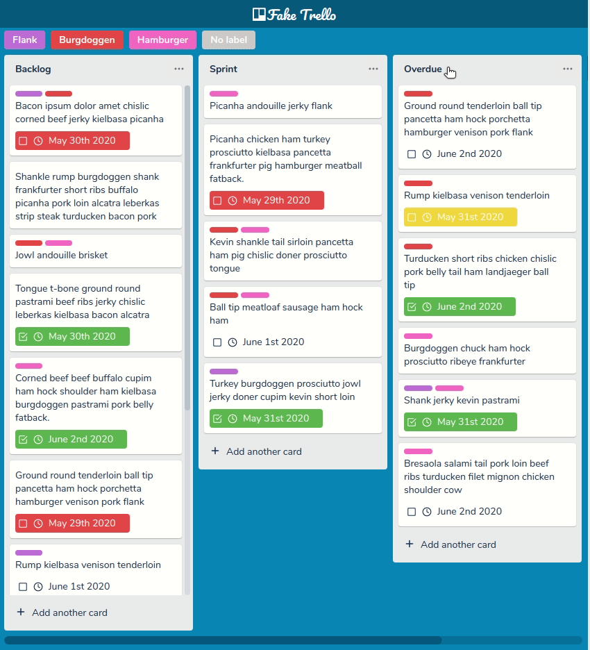

  

<h1 align="center" >Fake Trello</h1>

<blockquote align="center">
  A simple task manager for pesonal use inspired by trello interface.
</blockquote>

  

  

  

|&nbsp;&nbsp;&nbsp;
  <a href="https://cazuzabarberino.github.io/fake-trello/" target="_blank">
    Live Demo
  </a>
  &nbsp;&nbsp;&nbsp;|

  

## Contents

* [Motivation](#Motivation)
* [Features](#Features)
* [Libraries & Technologies](#Libraries-&-Technologies)
* [Instalation](#Instalation)

## Motivation

## Features

## Libraries & Technologies

## Instalation

